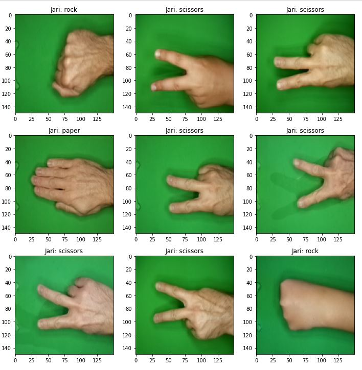
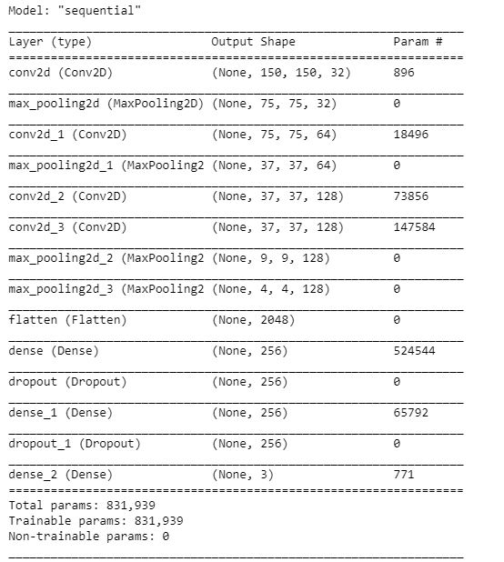

# rock_paper_scissors
Rock Paper Scissors program using CNN

Dataset consists of 3 kinds of hands

# Random sample of data

# CNN Model Summary

# Loss and Accuracy Model

# Model Evaluation

# Model Prediction Results

